# KITTI LiDAR-Camera Fusion

Sensor fusion pipeline on the [KITTI Raw dataset](http://www.cvlibs.net/datasets/kitti/raw_data.php): LiDAR-to-camera projection, interactive 3D/2D visualization with [Rerun](https://rerun.io/), and target-free LiDAR-camera calibration via ICP. Includes stereo camera calibration as extra credit.

---

## Tasks

### Task 1: LiDAR to Camera Projection

Projects Velodyne LiDAR point clouds onto the rectified camera image plane from first principles.

- Transforms 3D LiDAR points into camera coordinates using the extrinsic calibration matrix `T_cam_velo`
- Applies perspective projection with camera intrinsics `K`
- Filters points with `z <= 0` (behind the camera)
- Colors projected points by depth for both cam2 (left) and cam3 (right) stereo cameras

| cam2 LiDAR Overlay | cam3 LiDAR Overlay |
|---|---|
| 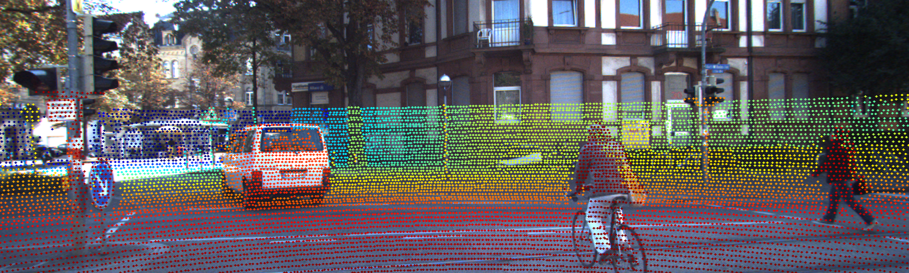 | 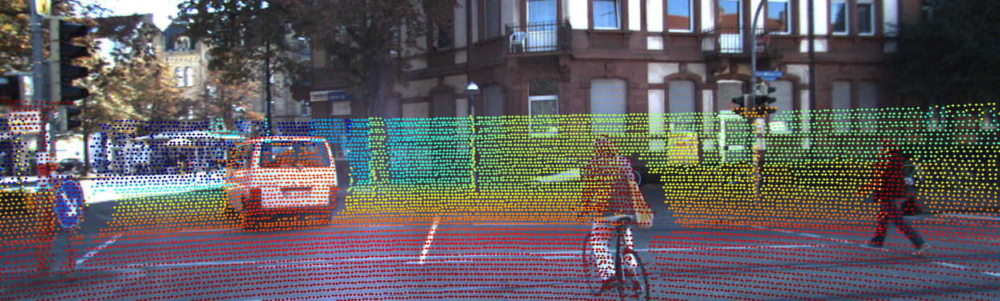 |

### Task 2: Rerun 3D Visualization

Builds an interactive multi-panel Rerun visualization layout logged over 100 frames.

- **3D world view**: LiDAR point cloud colored by distance, 3D tracklet bounding boxes, camera frustums
- **Four image overlays**: LiDAR projection and 3D box projections for cam2 and cam3
- All objects transformed from Velodyne frame into the cam0 rectified world frame
- GPS trajectory logged as a geo line string

| cam2 3D Boxes | cam3 3D Boxes |
|---|---|
| 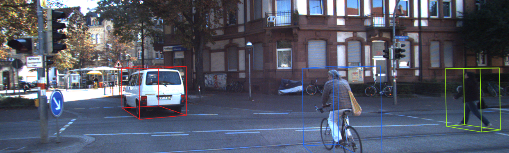 | 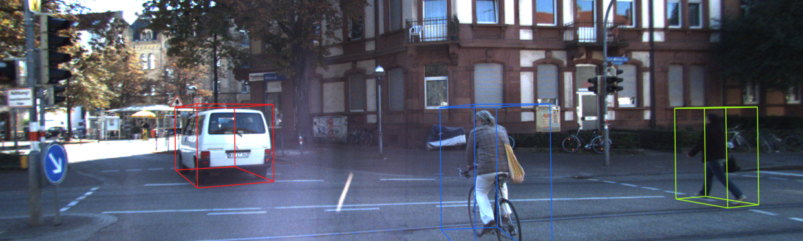 |

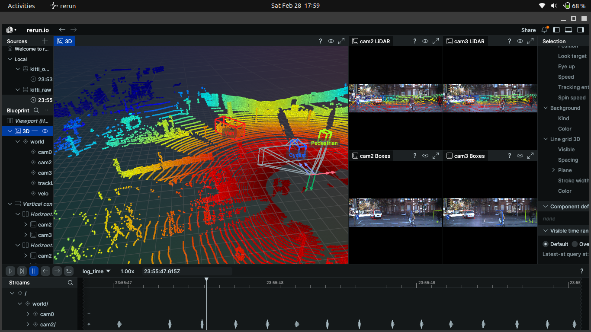

### Task 3: Target-Free LiDAR-Camera Calibration (ICP)

Calibrates the LiDAR-to-camera extrinsic transform without a calibration target, by aligning the Velodyne point cloud to a stereo-inferred 3D point cloud.

**Pipeline:**
1. **Disparity → 3D**: Unprojects a pre-computed stereo disparity map into camera-frame 3D points using the pinhole model (`Z = fx * baseline / disparity`)
2. **Noisy initialization**: Applies a known axis-alignment rotation plus random translation noise (`±1.5 m`) as the initial guess
3. **ICP alignment**: Runs Open3D point-to-point ICP (threshold `0.3 m`, 200 iterations) to refine the alignment
4. **Evaluation**: Reports rotation error (deg), translation error (m), and inlier ratios vs. the KITTI ground truth calibration

**Results:**

| Metric | Initial | After ICP |
|---|---|---|
| Rotation error | 0.851° | **0.540°** |
| Translation error | 1.314 m | **0.163 m** |
| Inlier ratio | 0.1153 | **0.7265** |
| GT inlier ratio | — | 0.8866 |

| Initial alignment | Estimated (ICP) | Ground Truth |
|---|---|---|
| 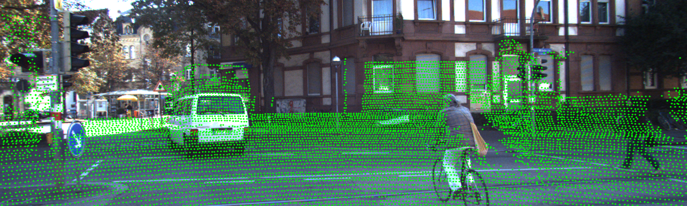 | 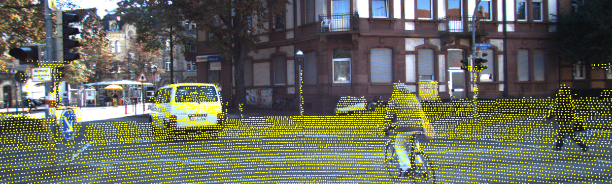 | 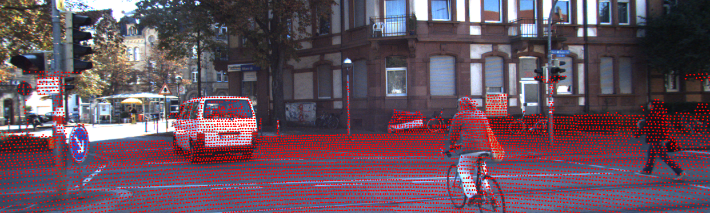 |

### Task 4: Stereo Camera Calibration from Checkerboard

Performs intrinsic stereo camera calibration from a pair of images containing multiple checkerboard patterns.

- Multi-scale tile-based detection (300-600 px tiles, 40% overlap) to find checkerboards at varying scales
- Refines corners to sub-pixel accuracy
- Calibrates left and right cameras individually, then performs stereo calibration
- Computes stereo rectification maps and generates a disparity map using OpenCV SGBM

**Results:**

| | Left (cam2) | Right (cam3) |
|---|---|---|
| Focal length | 721.54 px | 721.54 px |
| Principal point | (599.04, 350.18) | (739.35, 88.72) |
| RMS reprojection | 0.447 px | 0.440 px |

| Corners Detected (Left) | Corners Detected (Right) |
|---|---|
| 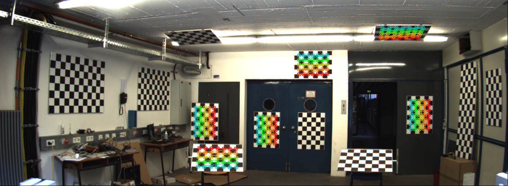 | 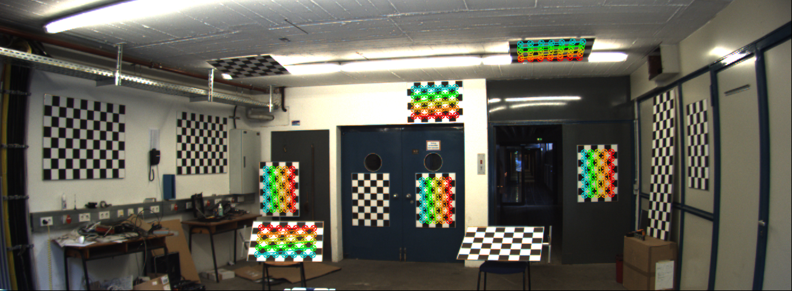 |

| Rectified Left | Rectified Right | Disparity |
|---|---|---|
| 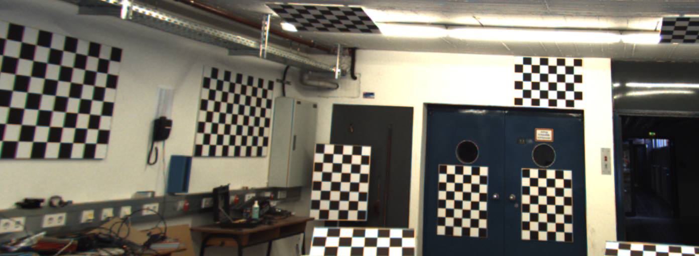 | 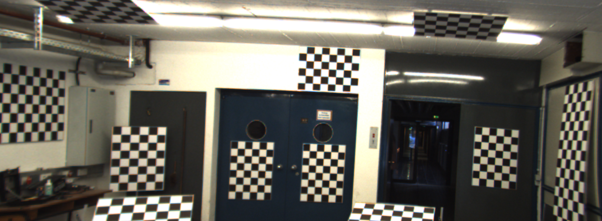 | 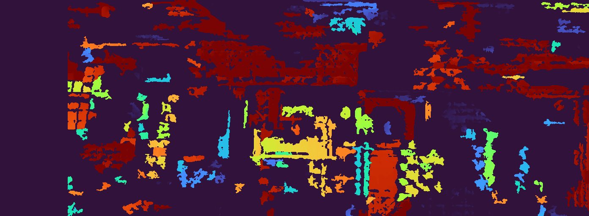 |

---

## Setup

```bash
conda create -n cs588 python=3.11.0
conda activate cs588
pip install -r requirements.txt
```

## Data

Download the KITTI raw data zip from the course Box link (requires UIUC login) and unzip to match this structure:

```
data/
├── extra_credit/
│   ├── cam2.png
│   └── cam3.png
└── kitti_raw/
    └── 2011_09_26/
        ├── 2011_09_26_drive_0005_sync/
        │   ├── disp_02/
        │   ├── image_00/, image_01/, image_02/, image_03/
        │   ├── oxts/
        │   ├── tracklet_labels.xml
        │   └── velodyne_points/
        ├── calib_cam_to_cam.txt
        ├── calib_imu_to_velo.txt
        └── calib_velo_to_cam.txt
```

## Running

```bash
# Tasks 1 & 2: LiDAR projection + Rerun visualization (launches Rerun viewer)
python kitti_viz.py --frames 100

# Task 3: Target-free LiDAR-camera calibration via ICP
python kitti_online_calib.py

# Extra credit: Stereo calibration from checkerboard
python extra_credit.py
```

## File Overview

| File | Description |
|---|---|
| `kitti_viz.py` | Tasks 1 & 2 — projection, box transforms, Rerun blueprint |
| `kitti_online_calib.py` | Task 3 — disparity unprojection, ICP alignment, evaluation |
| `extra_credit.py` | Stereo camera calibration from checkerboard patterns |
| `utils.py` | Geometry helpers, KITTI I/O, visualization utilities |

## Dependencies

- `pykitti` — KITTI dataset loader
- `rerun-sdk` — interactive 3D/2D visualization
- `open3d` — point cloud processing and ICP
- `numpy`, `opencv-python` — linear algebra and image ops

## Dataset

KITTI Raw `2011_09_26_drive_0005_sync` — 100 frames of urban driving with LiDAR, stereo cameras, and GPS/IMU.
